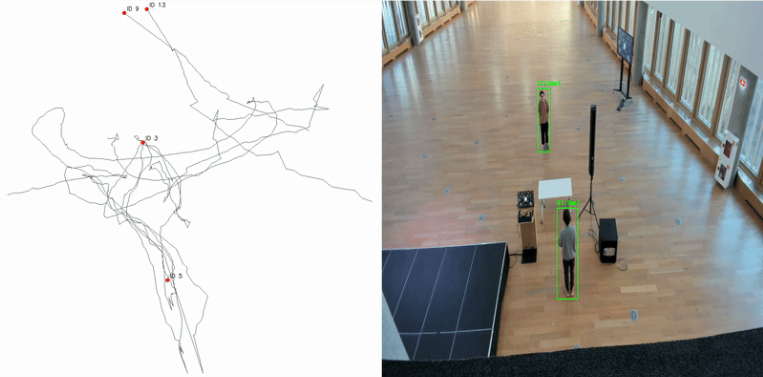
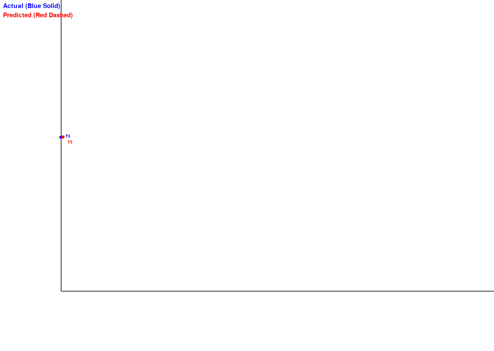
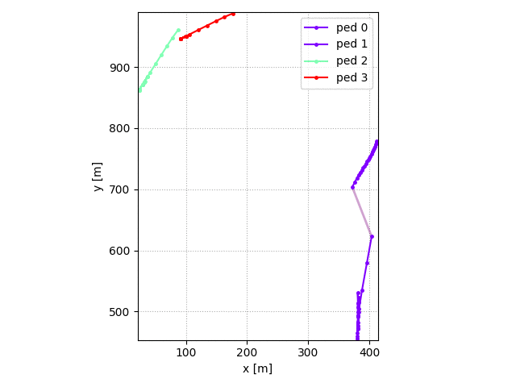
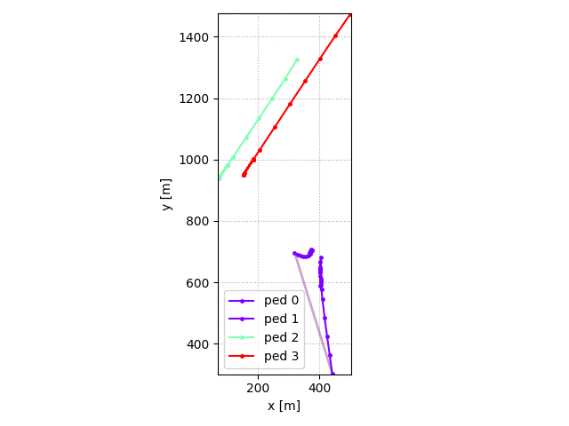
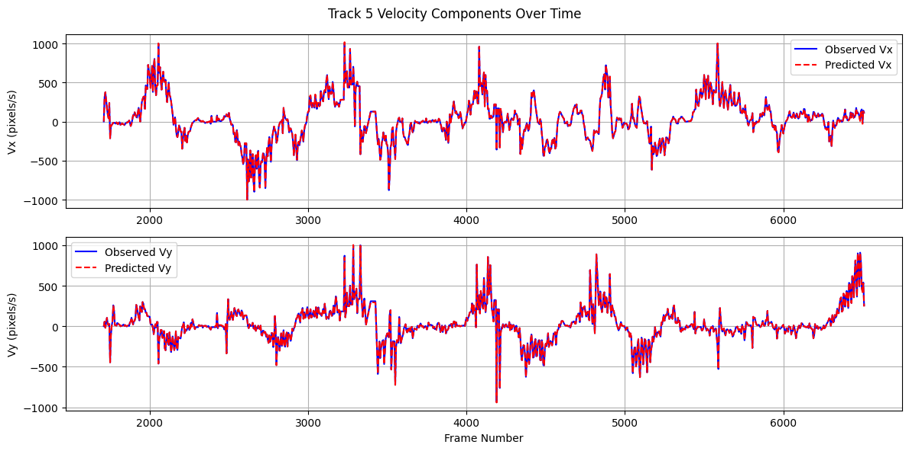
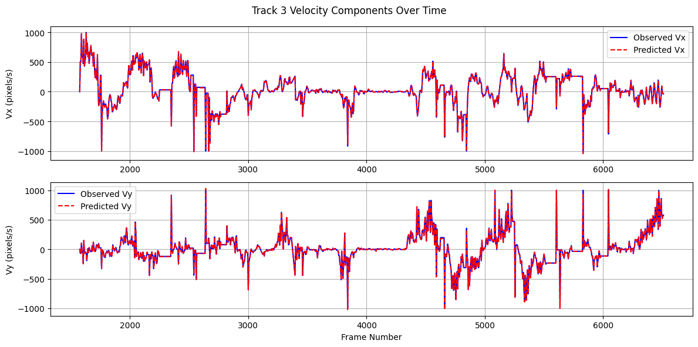

# PySocialForce

An exepriment on Social Force calculation on real data. 
The project consiists of 2 main modules: 
- Hardware: RGB camera setup
- Software 
  - Human detection and tracking with YOLO
  - Social Force was calculated based on PySocialForce framework and a custom approach 
  
## Table of Contents

- [PySocialForce](#pysocialforce)
  - [Table of Contents](#table-of-contents)
  - [About The Project](#about-the-project)
  - [Setup](#setup)
    - [Hardware Setup](#hardware-setup)
    - [Software Setup](#software-setup)
  - [Usage](#usage)
    - [Data Preprocessing](#data-preprocessing)
  - [Configuration](#configuration)
  - [Examples on Real Data](#examples-on-real-data)
  - [Examples on Artificial Data](#examples-on-artificial-data)
    - [Ped-ped Scenarios](#ped-ped-scenarios)
    - [Environmental obstacles](#environmental-obstacles)
  - [License](#license)
  - [Acknowledgements](#acknowledgements)
  - [References](#references)

## About The Project

This project implements an experiment on Social Force modeling.

The software component is based on the PySocialForce repository, which is a NumPy implementation of the **Extended Social Force Model** [[2]](#2).

## Setup

### Hardware Setup

- Data collection was performed using a wide-angle RGB camera.

- The camera was positioned at an elevated viewpoint.

- Human detection and tracking were performed using the YOLO model.

       

To convert pixel coordinates to metric space, a **Homography Matrix** was applied. However, the results were inconsistent.
To refine the data:

- **Savitzky-Golay filtering** was used to remove outliers.

- Additional **linear scaling along the Y-axis** was applied to approximate real-world measurements.

### Software Setup

1. Clone the repository

    ```sh
    git clone https://github.com/illusoryTwin/PySocialForce.git
    ```

2. (optional) Create a python virtual environment and activate it
3. Install the pip package

    ```sh
        # Option 1: install from PyPI
        pip install 'pysocialforce[test,plot]'

        # Option 2:  install from source
        pip install -e '.[test,plot]'

        # run linting and tests
        pylint pysocialforce
        pytest tests/*.py
    ```


## Usage

One can simply run `run_experiment.py` inside `pysocialforce` folder (substitute with your data) by:

```
python3 run_experiment.py 
```


To use the PySocialForce framework, load your data in the following format:

```csv
Track_ID,Image_File,X,Y,Vx,Vy,Speed
```


Where:
- **Track_ID**: Unique ID of a moving object (person).
- **X, Y**: Initial positions.
- **Vx, Vy**: Velocities.
- **Speed**: Computed speed.

### Data Preprocessing

Process your dataset using the data loader to retrieve the `initial_state` as follows:

```
columns = ["Track_ID", "px", "py", "vx", "vy", "gx", "gy"]
```

Where:
- **px, py**: Initial positions.
- **vx, vy**: Velocities.
- **gx, gy**: goal positions.
  
Example of usage:

```python
initial_state = load_initial_state(csv_file, start_timestep_id=5, end_timestep_id=45)
```

```python
# social groups information is represented as lists of indices of the state array
groups = [[0, 1], [2], [3]] 

# list of linear obstacles given in the form of (x_min, x_max, y_min, y_max)
obs = None
# initiate the simulator,
s = psf.Simulator(
    initial_state,
    groups=groups,
    obstacles=obs,
    config_file=Path(__file__).resolve().parent.joinpath("custom_config.toml"),
)
s.step(20)

Example of how to define a force 
des_force = forces.DesiredForce()
des_force.init(s, s.config)
des_force.factor = 1.0
```


## Configuration
You can configure the parameters by passing in a [toml](https://github.com/toml-lang/toml) file to the simulator:
```Python
sim = psf.Simulator(
        initial_state, groups=groups, obstacles=obstacles, config_file="user_config.toml"
    )
```

By default the simulator loads the configurations at [pysocialforce/utils/default.toml](pysocialforce/utils/default.toml).
An example of the user config and the explanation of the parameters is provided at [examples/example.toml](examples/example.toml).
Each force has a parameter named `factor`, which is the scale factor for that force. For specific parameters for each force, refer to the comments in the example below:
```Toml
...
[desired_force]
factor = 1.0
# The relaxation distance of the goal
goal_threshold = 0.2
# How long the relaxation process would take
relaxation_time = 0.5

[social_force]
factor = 5.1
# relative importance of position vs velocity vector
lambda_importance = 2.0
# define speed interaction
gamma = 0.35
n = 2
# define angular interaction
n_prime = 3

[obstacle_force]
factor = 10.0
# the standard deviation of obstacle force
sigma = 0.2
# threshold to trigger this force
threshold = 3.0

[group_coherence_force]
factor = 3.0

[group_repulsive_force]
factor = 1.0
# threshold to trigger this force
threshold = 0.55

[group_gaze_force]
factor = 4.0
# fielf of view
fov_phi = 90.0
```

## Examples on Real Data

       


Timestamps [5: 45]
       

Timestamps [45: 90]
  

The obtained plots.
  
  


## Examples on Artificial Data 
(Examples from the PySocialForce framework repo)

### Ped-ped Scenarios

|           |  |
| ----------------------------------------- | ------------------------------------- |
|  |     |

### Environmental obstacles

|                                                                              |                                                                                        |
| ------------------------------------------------------------------------------------------------------------- | -------------------------------------------------------------------------------------------------------------- |
| Emergent lane formation with Emergent lane formation with 30 pedestrians:  | Emergent lane formation with Emergent lane formation with 60 pedestrians:   |


## License

Distributed under the MIT License. See `LICENSE` for more information.

## Acknowledgements

- This project is based on [PySocialForce](https://github.com/yuxiang-gao/PySocialForce)'s implementation of the social force framework.
  

## References

<a id="1">[1]</a> Helbing, D., & Molnár, P. (1995). Social force model for pedestrian dynamics. Physical Review E, 51(5), 4282–4286. <https://doi.org/10.1103/PhysRevE.51.4282>

<a id="2">[2]</a> Moussaïd, M., Perozo, N., Garnier, S., Helbing, D., & Theraulaz, G. (2010). The walking behaviour of pedestrian social groups and its impact on crowd dynamics. PLoS ONE, 5(4), 1–7. <https://doi.org/10.1371/journal.pone.0010047>

[socialforce]: https://github.com/svenkreiss/socialforce

[pedsim_ros]: https://github.com/srl-freiburg/pedsim_ros
